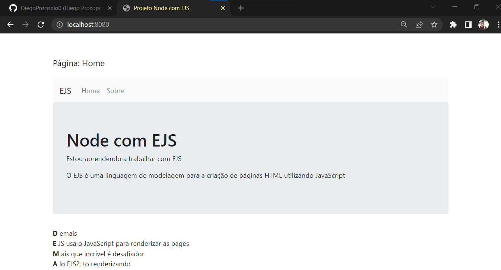

<h1 align="center"> Projeto de node com EJS </h1>

 

## 🚀 Tecnologias

Esse projeto foi desenvolvido com as seguintes tecnologias:

- HTML
- CSS
- JavaScript
- nodeJS
- Express

 

## 💻 Sobre o Projeto 
 

  

 
    Esse foi o meu primeiro projeto utilizando EJS, trabalhando com rotas e com server.

 

## 🖥 Como rodar o projeto 

    <!-- Utilize o comando a baixo para baixar todos os arquivos necessario  -->
    -npm i
    <!-- Utilize o comando a baixo para rodar o servidor  -->
    -node server

  - Após os comandos acima entre neste link <http://localhost:8080/>
  - O projeto já vai estar rodando na sua máquina

 by Diego Silva 

